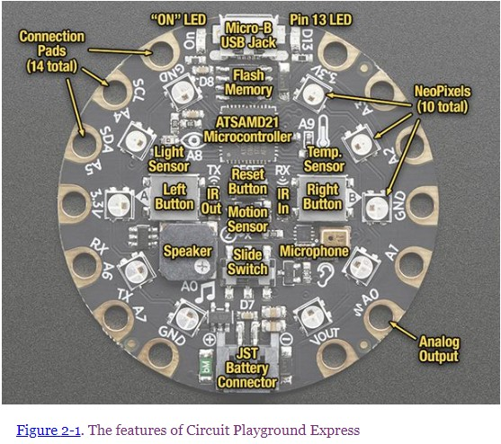

## Welcome to CPX101

### CPX101-1: Introduction: July31, 2020

#### 1. Adafruit, open sourceについて

- [Adafruitのページ](https://www.adafruit.com/)
- [AdafruitのLearningページ（Circuit Playground Expressで検索した結果）](https://learn.adafruit.com/search?q=circuit%2520playground%2520express)

#### 2. CPX microcontroller

- ボードの上にあるものたち
  - プロセッサーとメモリー
  - センサー
  - 入力装置
  - 出力装置
  
  
  
  （Getting Started with Adafruit Circuit Playground Expressより）

#### 3. CPXの指令書（プログラム）に使える言語

- Scratch - Javascript
- Python ([CircuitPython](https://circuitpython.org/))
- C++

#### 4. Makecodeで遊んでみる：Scratchで指令書を作る

- [Makecodeのページ](https://www.microsoft.com/en-us/makecode)

#### 5. わからないことは質問して解決しましょう

- 質問する前にしておくこと
- forumを作りました
  - ユーザー登録
  - 投稿の練習

#### 6. Reference books

- [Getting Started with Adafruit Circuit Playground Express](https://read.amazon.com/kp/embed?asin=B07H9J3G2P&preview=newtab&linkCode=kpe&ref_=cm_sw_r_kb_dp_-i8gFbFKKVSZX)
- 初心者のためのCircuitPythonの本１
  - [日本の販売サイト](https://booth.pm/ja/items/1575764)
  - [Adafruitのサイト](https://www.adafruit.com/product/4024)

---

### CPX101-2: CircuitPython with Mu editor: August 08, 15 2020

#### 1. downloadとインストール

##### Mu editor
[Mu editorのページ](https://codewith.mu)からdownloadリンクへ

WindowsとMac、別々に説明します。

[Mu EditorのGitHub page](https://github.com/mu-editor/mu)

##### Circuitpython
[Circuitpythonのページ](https://circuitpython.org/)からdownloadリンクに進む

バージョンがいくつかあります。どれを使うかを説明します。

##### Circuitpython library bundle
上のページにlibrary dwonloadへのリンクがあります。Circuitpythonのバージョンにあったものを選びます。

#### 2. pythonでCPXをプログラムする
##### まずはLチカ
[1_blink-LED.py](https://github.com/misson3/CPX101/blob/master/CPX101-2/1_blink-LED.py)

##### つぎにNeoPixelチカチカチカ...
[2_NeoPixel-test.py](https://github.com/misson3/CPX101/blob/master/CPX101-2/2_NeoPixel-test.py)

##### motion sensorの値をリアルタイムに表示してみる
[3_read-accelerometer.py](https://github.com/misson3/CPX101/blob/master/CPX101-2/3_read-accelerometer.py)

##### motion sensorマウス
[4_tilt-mouse.py](https://github.com/misson3/CPX101/blob/master/CPX101-2/4_tilt-mouse.py)

#### 3. Learning resources
##### Core ElectronicsのYoubube
- [Circuit Playground Express Workshop for Educators and Beginners](https://www.youtube.com/playlist?list=PLPK2l9Knytg4DJXeM5Jg-xgEH8RYkLuPg)

Play listになっています。Makecodeでの説明です。使っているのはScratchです。

Circuitpythonはこちら。

- [Intro to CircuitPython with Adafruit Circuit Playground Express](https://www.youtube.com/watch?v=TIcq6sr7EmY)

[Core Electronicsのchannel](https://www.youtube.com/channel/UCp5ShPYJvi2EA4hLUERa86w)を開いてCircuitpythonで検索してみてください。ほかにもいろいろ出てきます。Microbitを使ったものもあります。

### CPX101-2-extra: コードを２つ: August 16, 2020
CPX101-2でcircuitpythonでコードを書いて走らせることができるようになりました。さらに２つコード例を作りましたので、自分の手で打ち込んで試してみてください。
###### library bundleをすべてCPXにコピーしていない場合は、[INSTRUCTION.md](https://github.com/misson3/CPX101/blob/master/CPX101-2-extra/INSTRUCTION.md)を参照してください。

##### 赤外線リモコンからのシグナルパターンを読み取るプログラム
[ir-remote-pulses.py](https://github.com/misson3/CPX101/blob/master/CPX101-2-extra/ir-remote-pulses.py)

##### CPXの傾きに応じて音程とスピードの違うアルペジオを鳴らすプログラム
[tilt-arpeggiator.py](https://github.com/misson3/CPX101/blob/master/CPX101-2-extra/tilt-arpeggiator.py)

## 予告編

### CPX101-3: C++ with Arduino IDE: Date TBD
